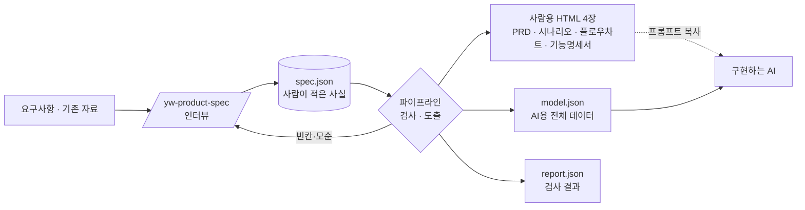

<div align="center">

# product-planning

**요구사항 한 줄에서 개발할 수 있는 기획서까지. 어떤 입력으로 시작해도 같은 구조, 같은 품질.**

PRD · 시나리오 · 플로우차트 · 기능명세서를 **사람이 읽는 HTML**로,
같은 내용 전체를 **AI가 읽는 `model.json`**으로 만든다.


[써 보기](#써-보기) · [무엇이 나오나](#무엇이-나오나) · [설계서](docs/설계서.md) · [산출물 명세](docs/산출물-명세.md)

</div>

---

## 왜 필요한가

기획서가 개발 입력이 되지 못하면 비용은 개발 도중에 치른다.

| 흔한 증상 | 결과 |
|---|---|
| 기획 문서에 옛 본문이 남아 서로 모순된다 | 개발자가 출처를 대조해 모순을 찾는다 |
| 상태 · 권한 · 검증 · 문구가 빠져 있다 | "이 상태에서 이 버튼은 보이나요?", "오류 문구는 뭐예요?"를 개발 중에 묻는다 |
| 엣지 케이스가 정리되어 있지 않다 | QA에서 처음 발견되고 기획을 다시 연다 |
| 여러 서비스(관리자·사용자 앱, API)를 따로 기획한다 | 한쪽의 결과가 다른 쪽에 빠진다 |
| 문서가 길다 | 읽지 않는다 |

이 파이프라인은 그 공백을 **개발 전**에 드러내고, 필요한 것만 짧게 남긴다.

## 무엇이 나오나



| 파일 | 누가 읽나 | 담는 것 |
|---|---|---|
| `{기능}.html` | 기획 · 리더 | **PRD**: 구성(서비스 · 앱 · API), 문제, 사용자, 지표, 요구사항 |
| `{기능}.scenarios.html` | 기획 · QA | **시나리오**: 요구사항마다 시나리오와 완료 조건 |
| `{기능}.flowcharts.html` | 모두 | **플로우차트**: 전체 흐름 · 시나리오 · 기능 · 페이지. 확대 · 이동되는 도화지 |
| `{기능}.spec.html` | 개발 · 디자인 | **기능명세서**: 서비스별 · 개체별로 누가 · 넣는 것 · 결과 · 막는 경우 |
| `model.json` | AI · 출력 어댑터 | 위 전부 + 화면 목록 · 이동 · 엣지 케이스 전체 · 검사 세부 |

사람용 문서는 **이것만 보고 개발할 수 있을 만큼만** 담고, 같은 사실을 두 번 쓰지 않는다. 흐름과 갈래는 그림으로, 정확한 값은 표로, 나머지는 데이터로 둔다.

## 핵심 아이디어

- **기획서는 요소와 관계의 모델이다.** 서비스, 앱, 사용자 유형, 요구사항, 시나리오, 개체, 상태, 동작, 입력, 문구가 서로 이어진다. 좋은 기획인지는 셀 수 있는 관계 규칙으로 판정한다.
- **동작 가능표가 중심이다.** 사용자 유형 × 동작 × 개체 상태를 한 표에 모으고, 빈칸은 그대로 "정할 것"이 된다.
- **그리지 않고 도출한다.** 화면, 플로우차트의 판단 갈래(권한 · 상태 · 입력 · 확인 창 · 서버 결과), 서비스 사이 연결, 엣지 케이스를 모델에서 규칙으로 만든다. 사람은 사실만 적는다.
- **검증은 형식으로 적는다.** `{ type: 'text', required: true, min: 2, max: 50 }` 같은 형식에서 경계값이 나온다. 글로만 적으면 경고한다.
- **문구를 모은다.** 공통 문구 9종(입력 오류 · 권한 없음 · 빈 화면 · 통신 실패 …)은 한 번, 확인 창과 다른 서비스 알림은 기능마다.
- **하네스가 스스로 검증한다.** 그림은 겹침(선 · 상자 · 글자)이 없어질 때까지 다시 그리고, 엣지 케이스가 플로우차트에 빠지면 경고한다.
- **사람에게는 한글 이름, 기계에게는 ID.** 문서에는 이름만 보이고 ID는 연결에만 쓴다.

## 써 보기

### Claude Code 플러그인으로

```text
/plugin marketplace add YeongWon2/product-planning
/plugin install product-planning@product-planning
```

설치하면 `/yw-product-spec` 명령이 생긴다. 대화 중에 알아서 켜지지 않고, 부를 때만 돈다.

```text
/yw-product-spec 관리자가 담당자에게 항목을 배정하고 담당자는 앱에서 알림을 받는다
```

요청한 범위만 다룬다. 답이 필요 없는 이슈는 스스로 고치고, 사람이 정할 빈칸만 1~3개씩 묻는다. **착수 가능 · 검사 통과율 100%**가 되면 빌드해서 결과를 브라우저 창으로 연다. 기존 기획 문서나 `spec.json`을 함께 주면 보완 · 변경으로 시작한다.

### 명령줄로

Node.js 20 이상이면 된다. 외부 의존성은 없다.

```bash
npm test
node scripts/spec.mjs check examples/assignment/spec.json
node scripts/spec.mjs build examples/assignment/spec.json --open
```

| 명령 | 결과 | 종료 코드 |
|---|---|---|
| `check <spec.json>` | 착수 가능 여부, 통과율, 차단 이슈 · 경고 · 정할 것 | 0 착수 가능 · 1 착수 불가 · 2 사용법 오류 · 3 읽기 실패 |
| `build <spec.json> [--out 폴더] [--open]` | HTML 네 파일, `model.json`, `report.json`. 남은 그림 겹침을 알리고, AI에게 붙여 넣을 프롬프트를 찍는다. `--open`이면 첫 HTML을 브라우저로 연다 | 0 (착수 불가여도, 창을 못 열어도 만든다) · 3 읽기 실패 |

예제 [`examples/assignment`](examples/assignment)는 일부러 동작 가능표 칸 하나를 비워 두었다. 그래서 착수 불가로 나오고, 다음 질문이 자동으로 만들어진다.

> '배정 관리자'는 '완료' 상태의 '항목'에 '항목 수정하기'를 할 수 있는가?

## 버전과 배포

버전은 `.claude-plugin/plugin.json` 한 곳에만 있고 **사람이 올리지 않는다.** `main`에 push하면 [release 워크플로](.github/workflows/release.yml)가 테스트를 돌린 뒤, 마지막 배포 태그 이후의 커밋으로 다음 버전을 정한다.

| 마지막 배포 이후 커밋 | 다음 버전 |
|---|---|
| 플러그인 파일(`.claude-plugin/` `skills/` `src/` `scripts/` `docs/`)이 바뀐 커밋이 없음 | 배포하지 않음 |
| `feat` 커밋이 있음 | minor |
| `fix` · 그 밖의 커밋만 있음 | patch |
| 호환이 깨지는 커밋(`feat!:`, 본문 `BREAKING CHANGE:`) | major (1.0.0 전에는 minor) |

배포하면 `plugin.json` 버전, [`CHANGELOG.md`](CHANGELOG.md), 태그 `product-planning--v{버전}`, GitHub Release가 함께 만들어진다. 배포 커밋은 봇이 `main`에 올리므로 다음 작업 전에 `git pull`로 받는다. 워크플로가 하는 일은 [`test/release-e2e.test.mjs`](test/release-e2e.test.mjs)가 로컬에서 그대로 재현한다. 미리 보기: `node tools/release.mjs plan`

설치한 쪽은 `claude plugin update product-planning@product-planning` 뒤 `/reload-plugins`로 받는다.

## 로드맵

- [x] 검사 · 화면 흐름 자동 도출 · 결정적 렌더 (같은 입력 → 같은 결과)
- [x] 명령으로만 도는 스킬, 통과율 100%까지 반복, 요청 범위만
- [x] 네 부분 문서(PRD · 시나리오 · 플로우차트 · 기능명세서) + AI용 `model.json` + 프롬프트 복사
- [x] 구성(서비스 · 앱 · API) · 입력 검증 형식 · 문구 수집
- [x] 전체 흐름 · 기능 · 페이지 플로우차트, 엣지 케이스 전체 도출, 겹침 · 누락 하네스
- [ ] 휴리스틱 평가 · 인지적 워크스루를 모델 판단으로 (근거 필수)
- [ ] 보완 모드 평가셋과 기준선
- [ ] 출력 어댑터 (문서형 · 디자인형 · 화이트보드형)

## 문서

| 문서 | 내용 |
|---|---|
| [설계서](docs/설계서.md) | 모델, 단계, 흐름 · 플로우차트 · 엣지 케이스 도출 규칙, 검토 기준, 문서 설계, 출력 대상 가이드, 검증 루프 |
| [산출물 명세](docs/산출물-명세.md) | `spec.json` 형식, 사람용 문서 구성, `model.json`, `report.json`, 그림 약속 — 구현의 계약 |
| [변경 기록](CHANGELOG.md) | 버전마다 바뀐 것 |
