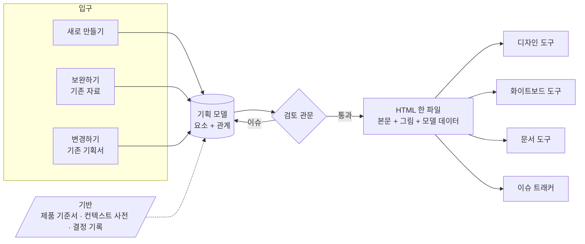

# product-planning

**어떤 입력으로 시작해도 같은 구조, 같은 품질의 기획서를 만드는 기획 파이프라인**

PRD · 유저 시나리오 · 화면 흐름 · 화면 구성 · 완료 조건을 **읽히는 HTML 한 파일**로 만들고,
그 파일을 디자인 도구 · 화이트보드 · 문서 도구 · 이슈 트래커로 옮긴다.

[설계서 읽기](docs/설계서.md) · [왜 필요한가](#왜-필요한가) · [어떻게 동작하나](#어떻게-동작하나) · [로드맵](#로드맵)

---

## 왜 필요한가

기획서가 개발 입력이 되지 못하면 비용은 개발 도중에 치른다.

| 흔한 증상 | 결과 |
|---|---|
| 기획 문서에 구버전 본문이 남아 서로 모순된다 | 개발자가 출처를 대조해 모순을 찾는다 |
| 화면 상태 · 권한 · 완료 조건이 없다 | "이 상태에서 이 버튼은 보이나요?"를 개발 중에 묻는다 |
| 명세가 디자인 파일 메모와 티켓에 흩어진다 | 무엇이 최신인지 아무도 모른다 |
| 관리자 쪽과 사용자 쪽을 따로 기획한다 | 같은 개념을 다른 말로 부르고, 한쪽 결과가 빠진다 |
| UX 기본 규칙이 없다 | 같은 문제를 화면마다 다르게 푼다 |

이 도구는 그 공백을 **개발 전, 기획 단계**에서 드러낸다.

## 어떻게 동작하나

### 핵심 아이디어

- **기획서는 요소와 관계로 이루어진 모델이다.** 사용자 유형, 요구사항, 시나리오, 개체, 상태, 동작, 화면, 완료 조건, 지표가 서로 이어진다.
- **좋은 기획인지는 관계로 판정한다.** "요구사항마다 완료 조건이 있는가", "모든 상태에 나가는 전이가 있는가"처럼 셀 수 있는 규칙이다.
- **동작 가능표가 중심이다.** 사용자 유형 × 동작 × 개체 상태를 한 표에 모으고, 빈칸을 그대로 "정할 것"으로 올린다.
- **한 사실은 한 곳에만 적는다.** 흐름도, 관계도, 추적표, 완료 조건 초안, 개발 티켓은 모두 파생된다.
- **사람에게는 한글 이름, 도구에게는 ID.** 문서에는 "항목 목록 · 빈 화면"처럼 이름만 보이고, ID는 연결에만 쓴다.

### 검토는 다섯 겹

| 겹 | 기준 | 판정 |
|---|---|---|
| 1 | 관계 규칙 | 기계 |
| 2 | 예외 상황 표준 목록 (빈 데이터, 권한 회수, 동시 수정, 네트워크 실패 …) | 기계 (다뤘는가) |
| 3 | 휴리스틱 평가 (Nielsen 10을 확인 질문으로) | 기계 + 모델 (근거 필수) |
| 4 | 인지적 워크스루 (시나리오 단계마다 4개 질문) | 모델 (근거 필수) |
| 5 | 정량 지표 (화면 전환 · 입력 · 결정 지점 수) | 계산 |

### 문서는 이렇게 읽힌다

- 어려운 용어 대신 한글로 쓴다: **상황 → 행동 → 결과**, 완료 조건, 빈 화면, 정할 것
- 모든 문장에 출처 배지가 붙는다: `코드` `스키마` `문서` `데이터` `레퍼런스` `결정` `가정`
- 역할별 읽기 경로가 있다: 기획 · 디자인 · 개발 · QA
- 맨 위에 품질 점수와 **착수 가능 / 착수 불가**가 표시된다

## 설계 원칙

1. 본체는 도메인을 모른다. 제품마다 다른 것은 프로젝트 프로필 한 파일에 둔다.
2. 모델은 판단만 하고, 문서 · 그림 · 출력은 정해진 규칙이 만든다.
3. 방향과 우선순위는 사람이 정한다. 도구는 기준에 맞는지를 검사한다.
4. 검증 기준은 이미 일어난 결함에서 가져온다. 목표 수치는 첫 측정 기준선에서 시작한다.

## 로드맵

- [ ] **P0** 모델 · 관계 규칙 · 예외 목록 · 휴리스틱 질문 확정
- [ ] **P1** 검사와 HTML 렌더 (같은 입력 → 같은 HTML)
- [ ] **P2** 보완 모드 파일럿 + 첫 평가셋 · 기준선
- [ ] **P3** 다른 도메인에서 본체 수정 없이 새로 만들기
- [ ] **P4** 출력 어댑터 2종 (문서형 · 디자인형)
- [ ] **P5** 실제 신규 기능에 적용

## 문서

| 문서 | 내용 |
|---|---|
| [설계서](docs/설계서.md) | 모델, 단계, 검토 기준, 문서 설계, 출력 대상 가이드, 검증 루프 |
