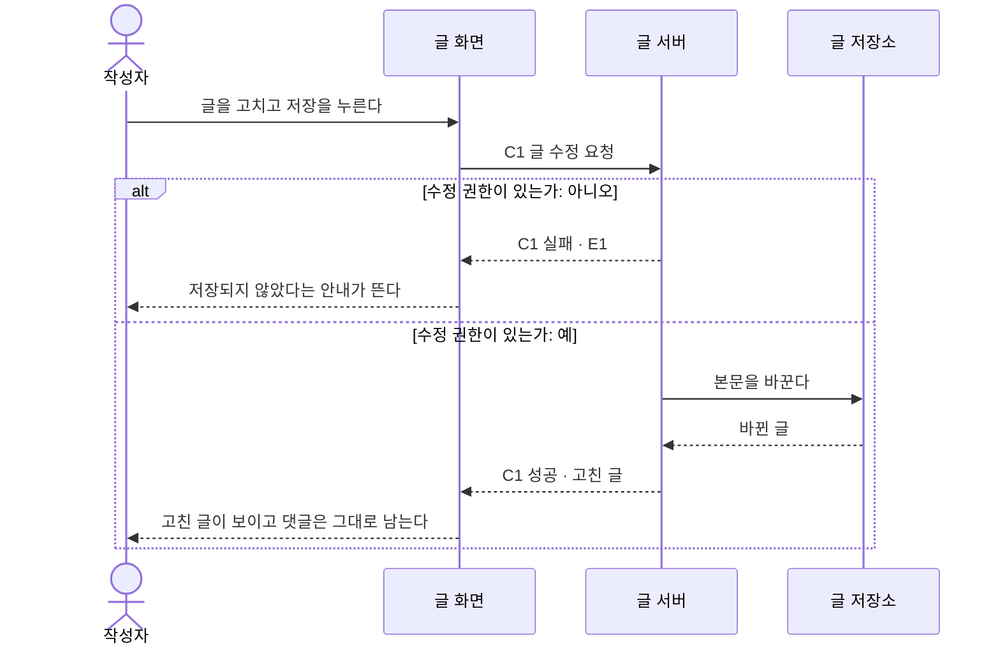

# 게시글 수정 시퀀스 다이어그램

상태: 확정

## S1 · 게시글 저장

```mermaid
sequenceDiagram
  actor P1 as 작성자
  participant A1 as 글 화면
  participant A2 as 글 서버
  participant A3 as 글 저장소
  P1->>A1: 글을 고치고 저장을 누른다
  A1->>A2: C1 글 수정 요청
  alt 수정 권한이 있는가: 아니오
    A2-->>A1: C1 실패 · E1
    A1-->>P1: 저장되지 않았다는 안내가 뜬다
  else 수정 권한이 있는가: 예
    A2->>A3: 본문을 바꾼다
    A3-->>A2: 바뀐 글
    A2-->>A1: C1 성공 · 고친 글
    A1-->>P1: 고친 글이 보이고 댓글은 그대로 남는다
  end
```

계약: C1 · 흐름: F1 › 기본 흐름 › 3. 사용자가 글을 고치고 저장을 누른다
